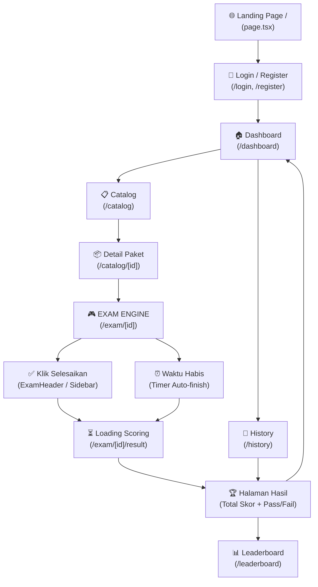

# 📊 Analisis Alur & Review Code — CPNS Platform V2.0

## 🗺️ Alur User Secara Keseluruhan

---

## 📈 Status Progress Per Area

| Area | Status | % Complete | Catatan Key Findings |
|------|--------|-----------|----------------------|
| 🔐 **Auth** | ✅ Done | 90% | JWT + HttpOnly Cookie. **Pro Account status support** (is_pro) terintegrasi. |
| 🏠 **Dashboard** | ✅ Done | 90% | Stats detail & Leaderboard Top 5. Responsive grid. |
| 📋 **Catalog List** | ✅ Done | 90% | Server-side Search & Filter. Caching Redis 5 menit. |
| 📦 **Catalog Detail** | ✅ Done | 85% | RBAC access check mendukung Pro Account (Global Access). |
| 🎮 **Exam Engine** | ✅ Done | 95% | Autosave Redis. Server-side Timer. Sidebar Responsive. |
| ✅ **Result Page** | ✅ Done | 95% | Polling logic stabil. Kalkulasi skor BKN akurat. |
| 📜 **History Page** | ✅ Done | 90% | Dynamic status tracks (Ongoing/Calculating/Finished). |
| 🏆 **Leaderboard** | ✅ Done | 95% | Redis ZSET. Ranking nasional real-time. |
| 💳 **Payment** | 🚧 Ongoing | 60% | **Pro Upgrade API ready**. Midtrans Webhook & Fulfillment logic backend stabil. |
| 📱 **Responsive** | ✅ Done | 90% | Optimized for Mobile & Desktop. |
| 🔒 **Security (RBAC)**| ✅ Done | 90% | Pro Account bypass logic. Admin protection on all admin APIs. |
| 🌐 **Admin Panel** | ✅ Done | 85% | **New: Analytics Dashboard & Transaction Status Override**. |

---

## 🔍 Analisis Mendalam Tiap Area (Updated V3.0)

### 1. 🌟 Pro Account & Global Access (New Feature)
- **Teknis:** Penambahan field `is_pro` dan `pro_expires_at` pada tabel `users`.
- **Logika:** Middleware `check_package_access` menggunakan shortcut logic: jika user adalah PRO, maka seluruh paket berbayar otomatis terbuka (`has_access: true`).
- **Review:** Transaksi `pro_upgrade` seharga Rp 50.000 memicu aktivasi status Pro selama 1 tahun via `fulfill_transaction`.

### 2. 📊 Admin Analytics & Dashboard (New Feature)
- **Revenue Tracking:** Total pendapatan dari transaksi `success` dihitung secara real-time.
- **Exam Performance:** Analitik nasional mencakup rata-rata skor per kategori dan *Pass Rate* berdasarkan ambang batas BKN (TWK: 65, TIU: 80, TKP: 166).
- **Trend:** Menampilkan grafik pendapatan harian (7-90 hari) dan share kategori paket populer.

### 3. 💳 Transaction Management & Midtrans
- **Fulfillment Logic:** Penanganan webhook Midtrans yang robust (`capture`, `settlement`, `cancel`, `deny`).
- **Manual Override:** Admin memiliki dashboard untuk mengubah status transaksi secara manual (`SET SUCCESS`), yang otomatis memberikan akses ke paket/pro account via fungsi `fulfill_transaction`.
- **Snap Token:** Integrasi token Midtrans Snap tersimpan di DB untuk mempermudah tracking transaksi yang menggantung.

### 4. 🧩 Exam Engine Optimization
- **Zustand State:** Penanganan state jawaban di frontend yang sinkron dengan Redis backend.
- **Server Confidence:** Timer backend tetap menjadi *source of truth*, mencegah kecurangan durasi di sisi client.

---

## 🛠️ Rekomendasi Langkah Selanjutnya (Roadmap V3.1)

1. **Snap Frontend Integration (High Priority):** Menyambungkan tombol "Beli Sekarang" dengan window Snap Midtrans agar user bisa membayar langsung.
2. **Google OAuth 2.0 (High Priority):** Menyelesaikan integrasi UI untuk login cepat guna meningkatkan konversi user.
3. **Push Notifications (Medium Priority):** Implementasi Web Push API untuk notifikasi real-time terkait tryout.
4. **Tryout Automation System (Strategic):** Sistem Manajemen Tryout Mingguan yang terotomasi.

---

## 🔬 Analisis & Penilaian Fitur Strategis

### A. Midtrans Snap Frontend Integration
**Status:** Fondasi backend & script loader sudah ada, namun implementasi UI masih bersifat "Placeholder" atau hardcoded.

- **Analisis & Aturan Bisnis:**
  - **Sesuai Konfirmasi:** Jika akun user adalah **PRO**, maka mereka memiliki akses ke **seluruh package** (Global Access). Tombol "Beli Sekarang" pada detail paket seharusnya tidak muncul bagi user PRO.
  - Untuk user non-PRO, sistem membutuhkan flow "Purchase Single Package" (Saat ini baru ada `/upgrade-pro`).
  - Script Snap sudah di-load di `RootLayout.tsx`.
- **File Penting untuk Di-Check:**
  - [package_api.py](file:///d:/ProjectAI/Test-CPNS/backend/api/v1/endpoints/package_api.py): Lihat fungsi `check_package_access` (Line 84) — ini adalah logic utama yang **memprioritaskan status PRO** di atas transaksi satuan.
  - [transactions_api.py](file:///d:/ProjectAI/Test-CPNS/backend/api/v1/endpoints/transactions_api.py): Tempat logika fulfillment (`fulfill_transaction`) berada.
  - [page.tsx (Catalog Detail)](file:///d:/ProjectAI/Test-CPNS/frontend/src/app/catalog/%5Bid%5D/page.tsx): Perlu pengecekan state `user.is_pro` untuk menyembunyikan tombol beli jika sudah PRO.

### B. Google OAuth 2.0
**Status:** Backend siap (`/auth/google`), Provider frontend sudah terpasang.

- **Analisis:**
  - Backend sudah menggunakan `google-auth` untuk verifikasi token. Profil user dibuat otomatis jika belum ada.
  - Frontend butuh komponen `GoogleLogin` (dari `@react-oauth/google`) di halaman login.
- **File Penting untuk Di-Check:**
  - [auth.py](file:///d:/ProjectAI/Test-CPNS/backend/api/v1/endpoints/auth.py): Lihat fungsi `google_login` (line 213).
  - [page.tsx (Login)](file:///d:/ProjectAI/Test-CPNS/frontend/src/app/login/page.tsx): Perlu penempatan tombol login Google.

### C. Best Practice: Weekly Tryouts & Push Notifications
Untuk menangani tryout yang update setiap minggu secara efisien (*Enterprise Standard*):

1. **Tryout Management (Backend):**
   - **Template-based:** Gunakan sistem "Draft" untuk paket soal. Admin menyiapkan bank soal di hari kerja, lalu sistem merilisnya otomatis di hari Sabtu/Minggu.
   - **CSV/Excel Bulk Import:** Karena soal berjumlah 110, admin dilarang input manual satu-satu. Gunakan `admin_import.py` yang sudah ada untuk upload massal.
   - **Soft-Delete & Versioning:** Jangan hapus tryout minggu lalu. Simpan sebagai arsip untuk fitur "Latihan Mandiri".

2. **Push Notifications (Architecture):**
   - **Web Push API (VAPID):** Cara paling efisien untuk browser modern tanpa aplikasi native.
   - **Celery Beat:** Gunakan scheduler untuk mengirim notifikasi 1 jam sebelum tryout dimulai.
   - **Notifikasi Segmented:** Kirimkan notifikasi hanya ke user yang memiliki target instansi yang relevan dengan paket tryout tersebut.

---
**OVERALL PROJECT COMPLETION: ~88%**
`Core Exam Lifecycle: 95% | Financial/Payment: 60% | Admin/Operations: 85%`
