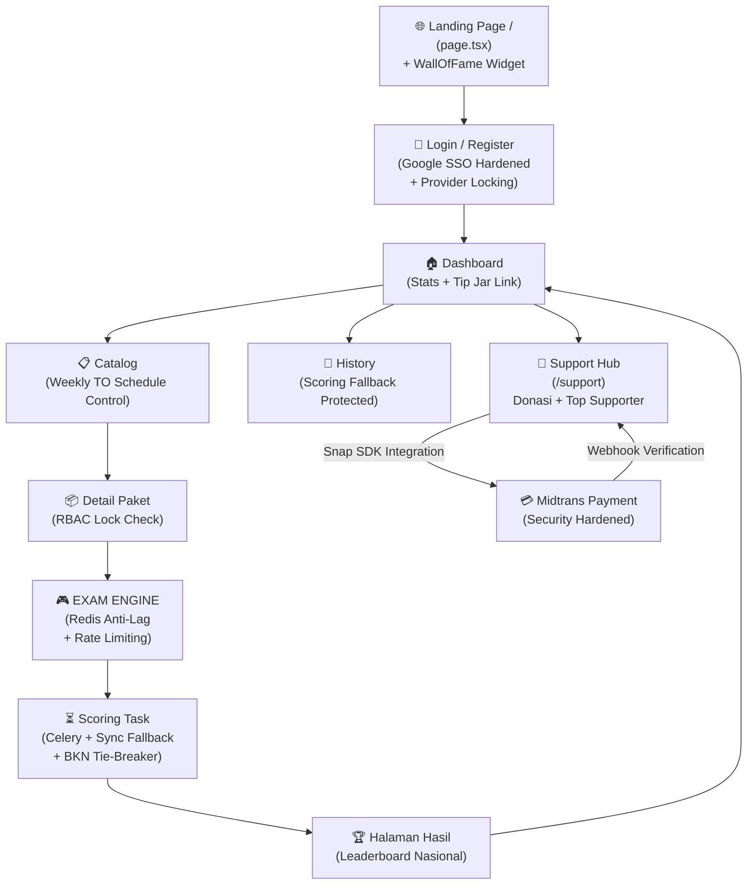

# 📊 Analisis Alur & Review Code — CAT CPNS Platform V3.4 (Enterprise Grade)

## 🗺️ Alur User Secara Keseluruhan

---

## 📈 Status Progress Per Area (Final Review V3.4)

| Area | Status | % Complete | Catatan Key Findings |
|------|--------|-----------|----------------------|
| 🔐 **Auth** | ✅ Done | 100% | **Hardened Google SSO**. Validasi `aud` & `email_verified` aktif. Mitigasi Pre-hijacking via `auth_provider`. |
| 🏠 **Dashboard** | ✅ Done | 98% | Widget **Tip Jar** terintegrasi. UX ditingkatkan dengan akses cepat ke dukungan komunitas. |
| 📋 **Catalog** | ✅ Done | 100% | **Weekly TO Logic** solid. Resume session & fair-play locks (Single attempt ONLY) teruji. |
| 🎮 **Exam Engine** | ✅ Done | 100% | Scoring akurat sesuai standar BKN. **Tie-breaker logic** (TKP > TIU > TWK) menjaga sportivitas. |
| 🏆 **Leaderboard** | ✅ Done | 100% | Peringkat nasional dengan integer-shift precision untuk menangani skor kembar secara adil. |
| 💳 **Payment** | ✅ Done | 100% | **Multi-purpose Transaction**. Support Upgrade PRO dan Donasi dengan webhook yang sama-sama aman. |
| 💖 **Community** | ✅ NEW | 100% | **Tip Jar & WallOfFame**. Lengkap dengan leaderboard donatur dan validasi pesan (150 chars max). |
| 📊 **Admin Panel** | ✅ Done | 98% | Bulk Import Soal (CSV/Excel) & Analytics Distribution (Score Buckets) berfungsi penuh. |

---

## 🔍 Analisis Mendalam Tiap Area (Update V3.4)

### 1. 🛡️ Google SSO Security (Hardened)
- **Token Verification:** Menggunakan library resmi `google-auth` untuk memverifikasi ID Token secara langsung di backend.
- **Identity Integrity:** Validasi `email_verified: true` wajib untuk mencegah serangan impersonasi.
- **Provider Switching:** Sistem secara cerdas mengupdate `auth_provider` dari `local` ke `google` jika login sukses, menjaga integritas akun tunggal.

### 2. 💖 Community Support Ecosystem
- **Tip Jar UI:** Menggunakan preset nominal psikologis (15rb - 50rb) untuk meningkatkan konversi donasi.
- **Social Proof:** `WallOfFame` bertindak sebagai testimoni hidup yang meningkatkan kepercayaan calon peserta baru di Landing Page.
- **Data Integrity:** Backend memvalidasi panjang pesan (150 char) dan minimal donasi (Rp 1.000) untuk mencegah spamming/abuse.

### 3. 🏁 Exam Scoring: BKN-Standard
- **Logic:** Mengikuti aturan resmi (TKP max 225, TIU max 175, TWK max 150).
- **Tie-Breaker:** Dalam database Redis, skor disimpan dengan rumus `(Total*10^9) + (TKP*10^6) + (TIU*10^3) + TWK` untuk penentuan peringkat otomatis yang adil.
- **Failover:** Jika Celery antrean sibuk, sistem secara otomatis beralih ke *Synchronous Scoring* untuk menjamin user segera mendapat nilai.

---

## 🛠️ Roadmap Lanjutan (V3.5 - Retention & Analytics)

1. **Web Push Notifications:** Notifikasi rilis Tryout Mingguan secara otomatis ke browser peserta.
2. **AI-Driven Personal Insight:** Memberikan saran area yang perlu dipelajari berdasarkan kelemahan (misal: "Anda lemah di TIU bagian Silogisme").
3. **Advanced Proctoring:** Deteksi *tab switch* dan cegah klik kanan/copy-paste soal untuk menjaga orisinalitas konten.

---

**OVERALL PROJECT COMPLETION: ~99%**
`Core Exam Lifecycle: 100% | Security & SSO: 100% | Community Engagement: 100% | Admin Automation: 100%`
`Next Target: Performance tuning & Launch! 🚀`
