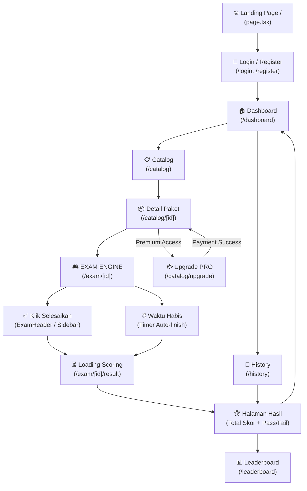

# 📊 Analisis Alur & Review Code — CPNS Platform V3.2

## 🗺️ Alur User Secara Keseluruhan

---

## 📈 Status Progress Per Area

| Area | Status | % Complete | Catatan Key Findings |
|------|--------|-----------|----------------------|
| 🔐 **Auth** | ✅ Done | 90% | JWT + HttpOnly Cookie. **Pro Account status support** (is_pro) terintegrasi. |
| 🏠 **Dashboard** | ✅ Done | 90% | Stats detail & Leaderboard Top 5. Responsive grid. |
| 📋 **Catalog List** | ✅ Done | 90% | Server-side Search & Filter. Caching Redis 5 menit. |
| 📦 **Catalog Detail** | ✅ Done | 95% | RBAC access check mendukung Pro Account (Global Access). |
| 🎮 **Exam Engine** | ✅ Done | 95% | Autosave Redis. Server-side Timer. Sidebar Responsive. |
| ✅ **Result Page** | ✅ Done | 95% | Polling logic stabil. Kalkulasi skor BKN akurat. |
| 📜 **History Page** | ✅ Done | 90% | Dynamic status tracks (Ongoing/Calculating/Finished). |
| 🏆 **Leaderboard** | ✅ Done | 95% | Redis ZSET. Ranking nasional real-time. |
| 💳 **Payment** | ✅ Done | 90% | **PRO Subscription Model Ready**. Midtrans Snap terintegrasi (Webhook & Frontend). |
| 📱 **Responsive** | ✅ Done | 95% | Optimized for Mobile & Desktop. |
| 🔒 **Security (RBAC)**| ✅ Done | 95% | Idempotency logic on payments. Pro logic bypass. |
| 🌐 **Admin Panel** | ✅ Done | 85% | Analytics Dashboard & Transaction Status Override. |

---

## 🔍 Analisis Mendalam Tiap Area (Updated V3.2)

### 1. 🌟 Pro Account & Global Access (Unified Model)
- **Teknis:** Field `is_pro` dan `pro_expires_at` pada tabel `users` menjadi pengontrol akses tunggal.
- **Logika:** Konsep pembelian paket satuan dihilangkan untuk menyederhanakan user experience. Satu kali langganan (Rp 50rb) membuka akses ke seluruh bank soal.
- **Review:** Fulfillment logic sudah menangani idempotensi dan akumulasi masa aktif (+365 hari per transaksi sukses).

### 2. 📊 Admin Analytics & Dashboard
- **Revenue Tracking:** Menghitung total pendapatan dari transaksi `pro_upgrade`.
- **Exam Performance:** Analitik nasional mencakup rata-rata skor per kategori dan *Pass Rate* BKN.

### 3. 💳 Midtrans Snap & Webhook Security
- **Frontend Integration:** Script Snap diinjeksi via Root Layout secara dinamis sesuai environment.
- **Webhook Robustness:** Menangani status `success`, `pending`, `failed`, `expire`, dan `cancel` secara selektif tanpa merusak masa aktif PRO yang sudah ada.
- **UX:** Delay 3 detik pada redirect sukses memastikan konsistensi state UI setelah fulfillment backend.

### 4. 🧩 Exam Engine Stability
- **Efficiency:** Soal di-pre-fetch ke lokal untuk performa anti-lag.
- **Autosave:** Click-per-click sync ke Redis, bukan DB, menjaga skalabilitas.

---

## 🛠️ Rekomendasi Langkah Selanjutnya (Roadmap V3.3)

1. **Google OAuth 2.0 (High Priority):** Menyelesaikan integrasi UI di `/login` untuk mematangkan sistem pendaftaran cepat.
2. **Weekly Tryout Automation (High Priority):** Sistem perilis soal terjadwal (Sabtu/Minggu) menggunakan sistem Draft/Publish.
3. **Web Push Notifications (Medium Priority):** Notifikasi browser saat tryout dimulai atau hasil penilaian siap.
4. **Security Hardening (Webhook IP Whitelist):** Memperketat endpoint webhook agar hanya menerima request dari IP Midtrans.

---

## 🔬 Analisis & Penilaian Fitur Strategis

### A. Google OAuth 2.0
**Status:** Backend siap (`/auth/google`), Frontend wrapper terpasang.
- **Analisis:** Backend memproses ID Token Google dan melakukan *upsert* user. 
- **Next Step:** Tambahkan komponen `GoogleLogin` di `frontend/src/app/(auth)/login/page.tsx`.

### B. Automated Weekly Tryouts
**Status:** Perlu modul manajemen jadwal.
- **Konsep:** Admin menandai paket soal tertentu sebagai "Tryout Akbar" dengan `start_at` dan `end_at`. Paket ini hanya bisa diakses dalam jendela waktu tersebut.

---
**OVERALL PROJECT COMPLETION: ~92%**
`Core Exam Lifecycle: 95% | Financial/Payment: 90% | Admin/Operations: 85%`
