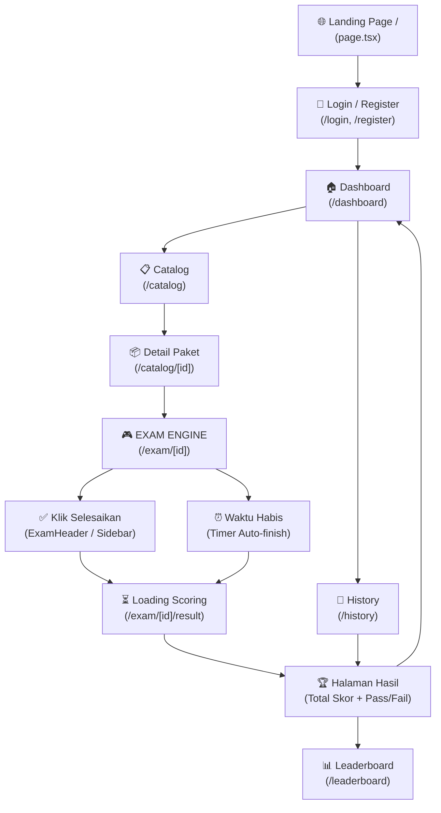

# 📊 Analisis Alur & Review Code — CPNS Platform V2.0

## 🗺️ Alur User Secara Keseluruhan



---

## 1. Dashboard `/dashboard`
**File:** [page.tsx](file:///d:/Project/Test-CPNS/frontend/src/app/dashboard/page.tsx)

### Apa yang Ada
- Navbar sticky dengan email user + tombol Logout
- 3 card: **My Progress** → `/history`, **Exam Catalog** → `/catalog`, **Launch CAT** → `/catalog`
- Auth guard: jika user null, tampil pesan + redirect manual ke login

### 🐛 Bug / Masalah
| # | Masalah | Lokasi | Dampak |
|---|---------|--------|--------|
| 1 | Redirect manual pakai `window.location.href = '/login'` bukannya `useRouter().push()` | baris 21 | Tidak idiomatic Next.js App Router, potensi full-page reload |
| 2 | Tidak ada statistik ringkas (skor terakhir, jumlah sesi) | seluruh halaman | Dashboard terasa **sangat kosong** — hanya 3 tombol |
| 3 | Card "Launch CAT" dan "Exam Catalog" keduanya menuju `/catalog` | baris 70 & 78 | Tidak ada perbedaan fungsi antara dua card ini |

---

## 2. Catalog `/catalog` & Detail `/catalog/[id]`
**File:** [catalog/page.tsx](file:///d:/Project/Test-CPNS/frontend/src/app/catalog/page.tsx), [catalog/[id]/page.tsx](file:///d:/Project/Test-CPNS/frontend/src/app/catalog/%5Bid%5D/page.tsx)

### Alur
- Fetch `GET /api/v1/packages/` dengan filter `category`
- Search client-side (filter dari state)
- Klik `PackageCard` → masuk ke detail `/catalog/[id]`
- Detail menampilkan info paket + tombol **"Mulai Ujian Sekarang"** → `/exam/[id]`

### 🐛 Bug / Masalah
| # | Masalah | Lokasi | Dampak |
|---|---------|--------|--------|
| 4 | **Tidak ada middleware RBAC** — tombol "Mulai Ujian" muncul untuk semua user tanpa cek transaksi | `catalog/[id]/page.tsx:129` | User yang belum bayar bisa langsung masuk ujian |
| 5 | Fetch catalog tidak menggunakan Authorization header / cookie | `catalog/page.tsx:35` | Paket premium tidak terlindungi di level frontend |
| 6 | Search hanya client-side, tidak debounced | `catalog/page.tsx:50-53` | Filter dilakukan setiap keystroke, boros di array besar |
| 7 | Loading state minimal (`bg-slate-900/20 animate-pulse`) tanpa fallback error UI | `catalog/page.tsx:113-118` | Saat API error, halaman hanya menampilkan kosong |

---

## 3. Exam Engine `/exam/[id]`
**File:** [exam/[id]/page.tsx](file:///d:/Project/Test-CPNS/frontend/src/app/exam/%5Bid%5D/page.tsx)

### Alur (3 Hooks Utama)
```
HOOK 1 (Init):
  POST /api/v1/exam/start/{id}
  → startExam(packageId, sessionId, questions, 100 menit)
  → Semua soal masuk Zustand + localStorage

HOOK 2 (Timer):
  setInterval → tick() setiap 1 detik
  → Jika timeLeft <= 1, set isFinished = true

HOOK 3 (Auto-finish):
  Jika isFinished == true:
    POST /api/v1/exam/finish/{sessionId}
    → router.push('/exam/{packageId}/result')
```

### Komponen Dalam Exam
| Komponen | Fungsi |
|---------|--------|
| [ExamHeader](file:///d:/Project/Test-CPNS/frontend/src/components/exam/ExamHeader.tsx#11-89) | Tampilkan timer + tombol **Selesaikan** |
| [QuestionDisplay](file:///d:/Project/Test-CPNS/frontend/src/components/exam/QuestionDisplay.tsx#10-133) | Tampilkan soal + opsi, handle [selectOption](file:///d:/Project/Test-CPNS/frontend/src/store/useExamStore.ts#67-71) + autosave to Redis |
| [ExamSidebar](file:///d:/Project/Test-CPNS/frontend/src/components/exam/ExamSidebar.tsx#11-119) | Grid navigasi soal (hijau/kuning/merah/abu), tombol **Selesaikan Ujian** |

### 🐛 Bug / Masalah
| # | Masalah | Lokasi | Dampak |
|---|---------|--------|--------|
| 8 | **Durasi hardcoded `100` menit** — tidak diambil dari response API | `exam/[id]/page.tsx:53` | Semua paket selalu 100 menit, tidak bisa disesuaikan |
| 9 | **Double-finish race condition**: `ExamHeader.handleFinish` dan `ExamSidebar.handleFinish` keduanya memanggil `POST /exam/finish` secara independen | kedua file | Jika user klik dua tombol, endpoint [finish](file:///d:/Project/Test-CPNS/frontend/src/store/useExamStore.ts#84-85) bisa dipanggil dua kali |
| 10 | [selectOption](file:///d:/Project/Test-CPNS/frontend/src/store/useExamStore.ts#67-71) di [QuestionDisplay](file:///d:/Project/Test-CPNS/frontend/src/components/exam/QuestionDisplay.tsx#10-133) memanggil [fetch()](file:///d:/Project/Test-CPNS/frontend/src/app/exam/%5Bid%5D/result/page.tsx#22-70) tanpa `await` (fire-and-forget) — tidak ada retry jika gagal | `QuestionDisplay:34` | Jawaban bisa tidak tersimpan ke Redis jika koneksi putus sesaat |
| 11 | **Session ID bisa null** saat autosave dijalankan (`sessionId` belum tentu tersedia) | `QuestionDisplay:34` | API autosave dipanggil dengan `sessionId = null` |
| 12 | Sidebar hanya tampil di `lg:block` (desktop) — tidak ada tombol toggle mobile | `exam/[id]/page.tsx:145` | Di mobile, navigasi soal tidak bisa diakses |
| 13 | [getStatusColor](file:///d:/Project/Test-CPNS/frontend/src/components/exam/ExamSidebar.tsx#53-63) di Sidebar tidak menampilkan status "ragu-ragu" di grid saat soal sudah dijawab sekaligus ragu | `ExamSidebar:53-62` | Visual ragu-ragu hilang jika sudah dijawab (prioritas jawaban > ragu) |
| 14 | Timer di `useExamStore.tick()` tidak sinkron dengan server-side timer | `useExamStore:79` | Manipulasi `localStorage` bisa mengubah waktu |

---

## 4. Halaman Hasil `/exam/[id]/result`
**File:** [result/page.tsx](file:///d:/Project/Test-CPNS/frontend/src/app/exam/%5Bid%5D/result/page.tsx)

### Alur
```
1. Cek sessionId di Zustand — jika null → redirect /dashboard

2. POST /api/v1/exam/finish/{sessionId}
   - Jika status = "processing" → polling setiap 2 detik
   - Jika status = "finished"   → tampilkan hasil

3. Tampilkan:
   - Total skor besar
   - Status LULUS / TIDAK LULUS vs Passing Grade
   - Breakdown TWK / TIU / TKP dengan progress bar

4. Tombol: Ke Dashboard | Lihat Ranking Nasional
```

### 🐛 Bug / Masalah
| # | Masalah | Lokasi | Dampak |
|---|---------|--------|--------|
| 15 | **"LUUD"** (typo) di badge status — harusnya "LULUS" | baris 229 | Typo tampil di UI produksi |
| 16 | Progress bar pada [CategoryScore](file:///d:/Project/Test-CPNS/frontend/src/app/exam/%5Bid%5D/result/page.tsx#214-256) menggunakan rumus [(score / (min * 1.5)) * 100](file:///d:/Project/Test-CPNS/frontend/src/store/useExamStore.ts#79-83) — nilai max **tidak akurat** | baris 221 | Bar TKP dengan skor 166 tidak akan 100% (divisor = 249) |
| 17 | Polling memanggil `POST /finish/` berulang settiap 2 detik — endpoint [finish/](file:///d:/Project/Test-CPNS/frontend/src/store/useExamStore.ts#84-85) bukan untuk polling | baris 44-57 | Endpoint [finish](file:///d:/Project/Test-CPNS/frontend/src/store/useExamStore.ts#84-85) seharusnya idempotent, tapi bisa membebani server jika lama |
| 18 | Jika `sessionId = null` setelah refresh halaman → redirect langsung tanpa menampilkan error | baris 23-25 | User yang refresh halaman hasil kehilangan datanya |

---

## 5. Riwayat `/history`
**File:** [history/page.tsx](file:///d:/Project/Test-CPNS/frontend/src/app/history/page.tsx)

### Alur
- Fetch `GET /api/v1/exam/sessions/me` (auth via cookie)
- Tampilkan daftar sesi: status badge (ONGOING/CALCULATING/P/L/TL), skor per kategori
- Klik kartu sesi → redirect ke `/exam/{package_id}/result`

### 🐛 Bug / Masalah
| # | Masalah | Lokasi | Dampak |
|---|---------|--------|--------|
| 19 | Redirect dari kartu history ke `/exam/{package_id}/result` padahal `sessionId` di Zustand sudah di-reset | baris 148 | Halaman result tidak bisa load data (sessionId null) |
| 20 | Tidak ada endpoint `GET /result/{sessionId}` untuk mengambil detail sesi lama | — | Tidak bisa melihat breakdown skor sesi lama |

---

## 6. Backend Scoring ([tasks.py](file:///d:/Project/Test-CPNS/backend/core/tasks.py))
**File:** [tasks.py](file:///d:/Project/Test-CPNS/backend/core/tasks.py)

### Alur Scoring
```
Celery Task: calculate_exam_score(session_id, user_id, user_email)
  → asyncio.run(async_run_scoring(...))
  1. Fetch ExamSession dari Postgres
  2. Fetch jawaban dari Redis: hgetall("exam_answers:{user_id}:{session_id}")
  3. Fetch Questions + Options
  4. Loop → kalkulasi score TWK/TIU/TKP berdasar Option.score
  5. Commit ke Postgres (session.status = "finished")
  6. ZADD "leaderboard:national" → Redis ZSET
  7. DEL cache key
```

### 🐛 Bug / Masalah
| # | Masalah | Lokasi | Dampak |
|---|---------|--------|--------|
| 21 | `asyncio.run()` dipanggil di dalam Celery task — berpotensi conflict jika Celery worker sudah memiliki event loop aktif | baris 142 | Worker crash di beberapa environment Celery |
| 22 | Tidak ada mekanisme retry jika scoring gagal | — | Skor hilang tanpa notifikasi ke user |

---

## 📊 Progress Keseluruhan — Berapa Persen?

| Area | Status | % Complete | Catatan |
|------|--------|-----------|---------|
| 🏠 Landing Page | ✅ Done | 85% | Ada, tapi belum ada fitur promosi/pricing page |
| 🔐 Auth (Login/Register) | ✅ Done | 80% | JWT + cookie OK, belum ada Google OAuth |
| 🏠 Dashboard | ⚠️ Minimal | 40% | Hanya 3 tombol, tidak ada statistik user |
| 📋 Catalog List | ✅ Done | 75% | Fetch + search + filter kategori berjalan |
| 📦 Catalog Detail | ⚠️ Partial | 60% | UI bagus, tapi **tidak ada RBAC/payment gate** |
| 🎮 Exam Engine | ✅ Core Done | 70% | Autosave, timer, navigasi soal OK; ada beberapa bug |
| ✅ Result Page | ✅ Done | 80% | UI premium, typo "LUUD", progress bar kurang akurat |
| 📜 History Page | ⚠️ Partial | 65% | Tampil list OK, **tidak bisa lihat detail skor lama** |
| 🏆 Leaderboard | ❓ Unknown | ? | Belum sempat di-review |
| 💳 Payment / Transaksi | ❌ Missing | 0% | Tidak ada payment flow, semua paket bisa diakses bebas |
| 📱 Responsive Mobile | ⚠️ Partial | 50% | Sidebar exam hilang di mobile |
| 🔒 Security (RBAC) | ❌ Missing | 10% | Middleware authorisasi paket premium tidak ada |
| 🌐 Admin Panel | ✅ Exists | ? | Ada folder `/admin`, belum di-review |

### 🎯 Estimasi Total Completion

```
Core User Flow (Login → Ujian → Hasil):   ████████░░  78%
Fitur Pendukung (History, Leaderboard):   █████░░░░░  55%
Security & Business Logic:                ██░░░░░░░░  20%
Payment System:                           ░░░░░░░░░░   0%
─────────────────────────────────────────────────────────
OVERALL:                                  ~53%
```

> [!IMPORTANT]
> Core exam flow sudah berjalan end-to-end ✅. Namun fitur payment, RBAC premium, dan detail riwayat skor lama **belum ada sama sekali** — ini yang menarik skornya ke ~53%.

---

## 🔧 Prioritas Fix yang Disarankan (Quick Wins)

1. **[CRITICAL]** Tambahkan guard RBAC di `/catalog/[id]` — cek transaksi sebelum tombol "Mulai Ujian" aktif
2. **[HIGH]** Fix typo `"LUUD"` → `"LULUS"` di `result/page.tsx:229`
3. **[HIGH]** Fix redirect dari History ke result: gunakan `session_id` dari list, bukan Zustand store
4. **[MEDIUM]** Tambahkan endpoint `GET /api/v1/exam/sessions/{sessionId}/result` untuk fetch hasil lama
5. **[MEDIUM]** Buat tombol toggle sidebar nav soal untuk mobile
6. **[MEDIUM]** Hardcode 100 menit → ambil dari `data.duration` response API
7. **[LOW]** Perbaiki formula progress bar: gunakan skor maksimum absolut (TWK=175, TIU=175, TKP=225)
