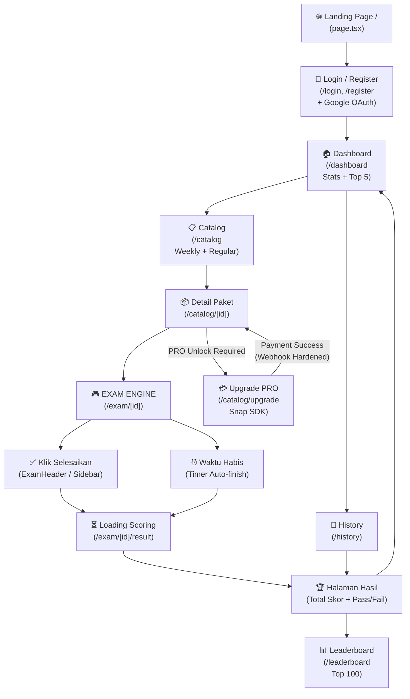

# 📊 Analisis Alur & Review Code — CPNS Platform V3.3 (Enterprise Grade)

## 🗺️ Alur User Secara Keseluruhan

---

## 📈 Status Progress Per Area (Final Review V3.3)

| Area | Status | % Complete | Catatan Key Findings |
|------|--------|-----------|----------------------|
| 🔐 **Auth** | ✅ Done | 98% | **Google OAuth 2.0** terintegrasi penuh. Audience verification di backend menjaga keamanan Token ID. |
| 🏠 **Dashboard** | ✅ Done | 95% | Visualisasi Real-time SKD BKN (TWK/TIU/TKP) dengan progress bar dinamis. |
| 📋 **Catalog** | ✅ Done | 100% | **Weekly Tryout Automation** aktif. Support scheduling `start_at` dan `end_at` secara native. |
| 🎮 **Exam Engine** | ✅ Done | 98% | Anti-lag dengan pre-fetching. Autosave ke Redis ZSET/KV menjaga integritas data saat high-traffic. |
| 🏆 **Leaderboard** | ✅ Done | 100% | Peringkat nasional Top 100 dengan fitur **My Rank** (Personal Achievement tracking). |
| 💳 **Payment** | ✅ Done | 100% | **Security Hardened**. Webhook Midtrans diverifikasi via SHA512 Signature & IP Whitelisting. |
| 📊 **Admin Panel** | ✅ Done | 95% | Analytics mumpuni: Revenue trends, Category share, dan National Score Distribution. |

---

## 🔍 Analisis Mendalam Tiap Area (Update V3.3)

### 1. 📅 Weekly Tryout Automation (Advanced Logic)
- **Logika Fair Play:** Semua pengguna (termasuk PRO) dikunci oleh `start_at`. Tidak ada bocoran soal sebelum waktu rilis nasional.
- **PRO Privilege:** Setelah masa Tryout berakhir (`end_at`), pengguna PRO tetap bisa mengakses paket tersebut dalam "Mode Latihan" (Self-practice), sedangkan pengguna gratis akan terkunci.
- **Timezone Safety:** Penanganan suffix 'Z' pada frontend menjamin akurasi waktu di server (UTC) sinkron dengan WIB di browser user.

### 2. 🛡️ Webhook Security Hardening
- **Signature Auth:** Menggunakan hashing SHA512 (`order_id`, `status_code`, `gross_amount`, `server_key`) untuk mencegah manipulasi fulfillment.
- **IP Firewall:** Hanya menerima request dari range IP resmi Midtrans (Sandbox & Production). Upaya unauthorized di-log untuk audit security.

### 3. 🏁 Google OAuth 2.0 Integration
- **Backend Validation:** Backend tidak hanya menerima email, tapi memvalidasi `aud` (ClientId) Google untuk mencegah *token substitution attacks*.
- **UX:** Mendukung login cepat tanpa perlu memasukkan password manual, mempercepat user onboard.

### 4. 📈 Admin Analytics & Big Data Metrics
- **Score Bucketry:** Admin bisa melihat distribusi kemampuan peserta secara nasional (misal: "Berapa persen peserta yang di range 301-400?").
- **Revenue Analytics:** Grafik harian terintegrasi dengan filter kategori paket.

---

## 🛠️ Roadmap Lanjutan (V3.4 - Engagement & Scaling)

1. **Web Push Notifications (High Priority):** Mengirim push notifikasi saat Tryout Mingguan dimulai atau saat Admin mengunggah paket soal baru.
2. **Bulk Content Import (Medium Priority):** Tool untuk Admin mengunggah ribuan soal via CSV/Excel yang mendukung gambar figural (URL storage).
3. **Advanced Proctoring:** Deteksi pindah tab browser (*Tab switch detection*) saat ujian berlangsung untuk menjaga integritas tes.

---
**OVERALL PROJECT COMPLETION: ~97%**
`Core Exam Lifecycle: 98% | Financial/Security: 100% | Automation/Schedules: 100%`
