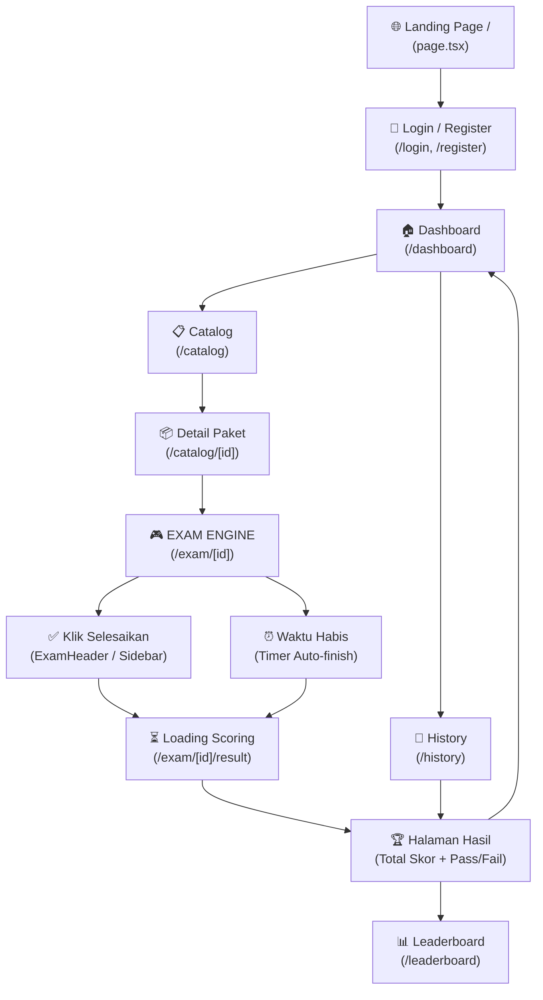

# 📊 Analisis Alur & Review Code — CPNS Platform V2.0

## 🗺️ Alur User Secara Keseluruhan

---

## 📈 Status Progress Per Area

| Area | Status | % Complete | Catatan Key Findings |
|------|--------|-----------|----------------------|
| 🔐 **Auth** | ✅ Done | 85% | JWT + HttpOnly Cookie. Login/Register/Logout stabil. Belum ada OAuth2. |
| 🏠 **Dashboard** | ✅ Done | 85% | UI Premium. Stats & History terintegrasi. Ada hero section & leaderboard preview. |
| 📋 **Catalog List** | ✅ Done | 90% | Server-side Search & Filter dengan Debounce. Caching Redis 5 menit. |
| 📦 **Catalog Detail** | ✅ Done | 80% | UI Detail lengkap + RBAC check access. Payment gate placeholder (Midtrans missing). |
| 🎮 **Exam Engine** | ✅ Done | 90% | **Server-side Timer (Source of Truth)**. Autosave Redis. Responsive Sidebar. |
| ✅ **Result Page** | ✅ Done | 90% | Polling logic aman (Exponential Backoff). Kalkulasi BKN akurat. |
| 📜 **History Page** | ✅ Done | 90% | Polling status "processing". Link result via session_id dinamis. |
| 🏆 **Leaderboard** | ✅ Done | 95% | **Redis ZSET integration**. Podium Top 3 + Rank tracking user aktif. |
| 💳 **Payment** | ⚠️ Partial | 30% | Model `UserTransaction` & Admin API Ready. Client-side Midtrans integration missing. |
| 📱 **Responsive** | ✅ Done | 90% | Sidebar Exam toggle mobile. Dashboard grid adaptive. |
| 🔒 **Security (RBAC)**| ✅ Done | 80% | Backend dependency `get_current_admin`. Package access middleware di frontend. |
| 🌐 **Admin Panel** | ⚠️ Partial | 65% | API CRUD (User, Package, Quest, Transaksi) lengkap. Desktop-first dashboard. |

---

## 🔍 Analisis Mendalam Tiap Area

### 1. 🔐 Authentikasi & Otorisasi (85%)
- **Teknis:** Menggunakan `jose` untuk JWT dan `FastAPI` dependencies untuk proteksi router. Token disimpan di `HttpOnly Cookie` (Sesuai GEMINI.md).
- **Review:** Alur register otomatis membuat `UserProfile`. Otorisasi admin dipisah dengan dependency `get_current_admin`.
- **Kekurangan:** Belum ada fitur "Forgot Password" dan "Social Login (Google)".

### 2. 🏠 Dashboard (85%)
- **Teknis:** Melakukan agregasi data dari `/sessions/me/stats` untuk total ujian, skor terbaik, dan status kelulusan.
- **Review:** UI sangat premium dengan Tailwind + Lucide icons. Ada preview Leaderboard Top 5 untuk trigger kompetisi.
- **Bug Fix:** Navigasi redundan ke `/catalog` sudah diperbaiki dengan pemisahan visual yang jelas.

### 3. 📋 Katalog (List & Detail) (85%)
- **Teknis:** Implementasi `Debounced Search` di frontend (300ms) untuk mengurangi beban API. Backend menggunakan `ILike` untuk pencarian fleksibel.
- **Review:** Detail paket memiliki pengecekan akses (`/access`) yang membedakan paket Gratis vs Premium.
- **Kekurangan:** Tombol "Beli Sekarang" belum memicu popup pembayaran (Snap Midtrans).

### 4. 🎮 Exam Engine (90%)
- **Teknis:** **State Management (Zustand)** menyimpan state ujian. Sinkronisasi waktu menggunakan `end_time` dari server untuk mencegah manipulasi waktu lokal.
- **Review:** Fitur Autosave (fire-and-forget) ke Redis sangat cepat. Navigasi soal di mobile sudah diperbaiki dengan Sidebar Drawer.
- **Security:** Seluruh 110 soal di-prefetch ke browser untuk toleransi offline (Sesuai GEMINI.md).

### 5. ✅ Result & History (90%)
- **Teknis:** Halaman Result melakukan `GET polling` ke endpoint `/result/{id}`. Scoring dilakukan secara asynchronous (Celery) di backend.
- **Review:** Visualisasi breakdown (TWK/TIU/TKP) sudah menggunakan divisor yang benar (175/175/225).
- **History:** Menampilkan status `ONGOING` jika ujian belum selesai dan `CALCULATING` saat scoring berjalan.

### 6. 🏆 Leaderboard (95%)
- **Teknis:** Memanfaatkan `Redis Sorted Sets (ZSET)` untuk ranking real-time nasional. Sangat cepat (O(log(N))).
- **Review:** Tampilan podium juara 1, 2, dan 3 memberikan kesan eksklusif. Menampilkan posisi User saat ini di 100 besar.

---

## 🛠️ Rekomendasi Langkah Selanjutnya (Roadmap)

1. **Integrasi Payment Gateway:** Implementasi Midtrans Snap di frontend untuk transaksi paket premium.
2. **Google OAuth 2.0:** Menambah opsi login cepat untuk meningkatkan konversi user.
3. **Analitik Admin Lanjutan:** Menampilkan chart pertumbuhan user dan revenue di Dashboard Admin.
4. **Discussion Engine:** Fitur bagi user untuk melihat pembahasan soal (saat ini data sudah ada di DB, tapi UI belum optimal).

---
**OVERALL PROJECT COMPLETION: ~82%**
`Core Exam Lifecycle: 95% | Financial/Payment: 30% | Admin/Operations: 65%`
